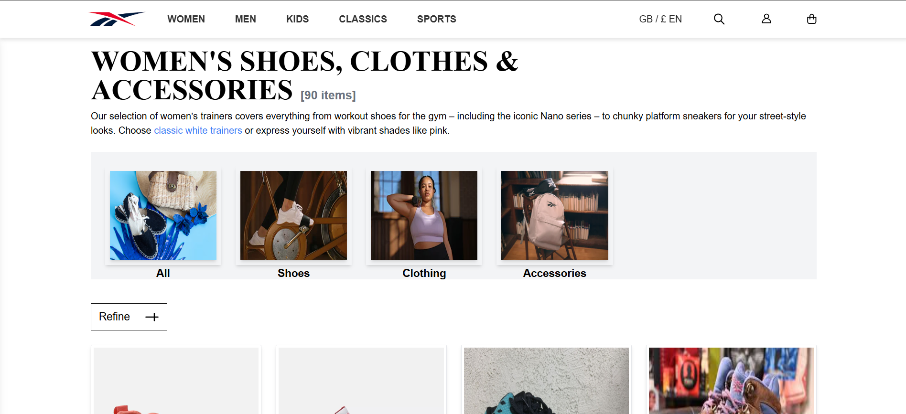
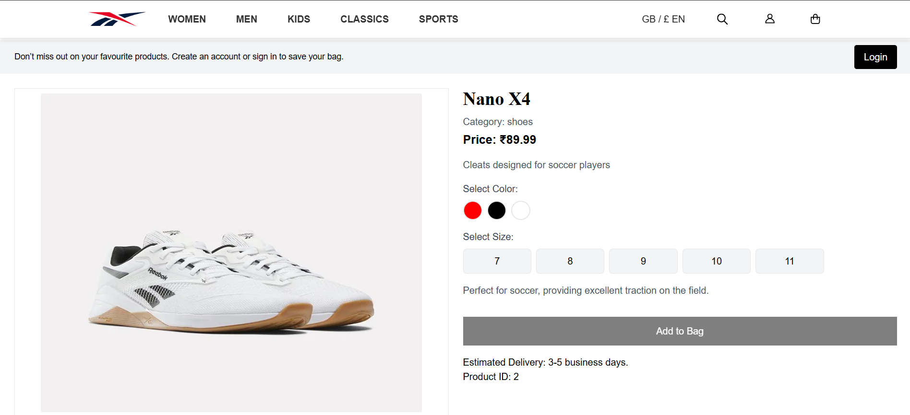
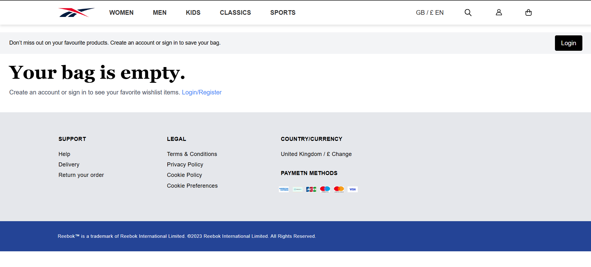
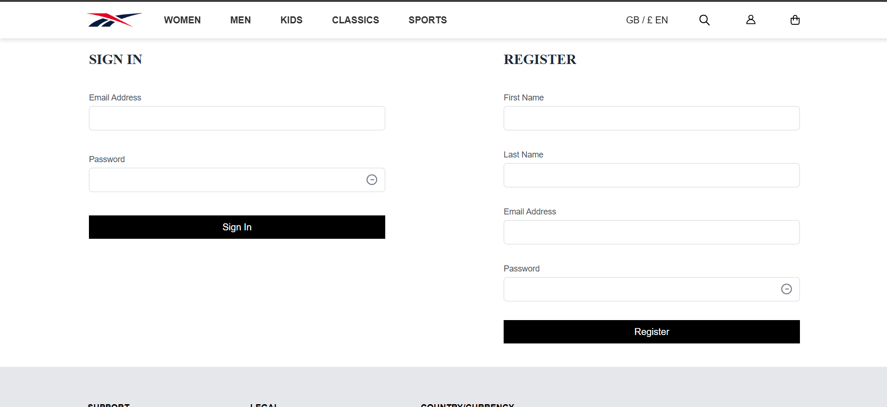
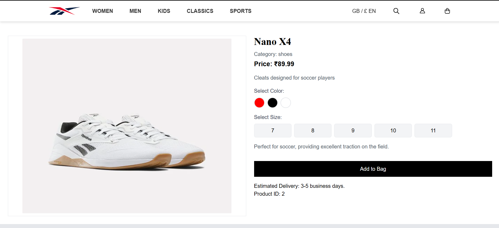
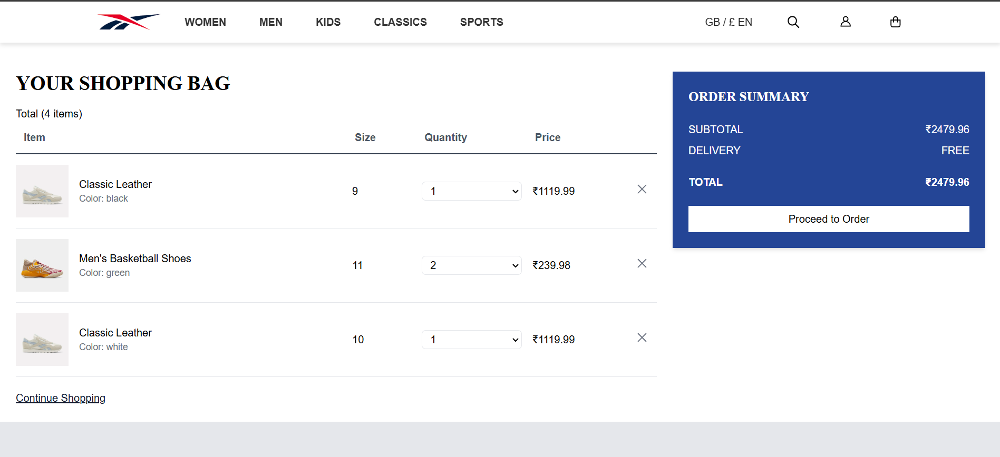

# Reebok Ecommerce Project

## Introduction
The Reebok website clone is a dynamic e-commerce application designed to replicate the core functionalities of an online shopping platform. It includes dynamic pages for Men, Women,Classic and Sports categories, along with filtering, sorting, and pagination features. The app provides a seamless shopping experience, enabling users to view products, filter them by category, sort by price or other criteria, and add items to their bag. It also includes authentication to ensure a secure and personalized experience.

## Project Type
Frontend

## Deployed App
Frontend: https://ecommerce-reebok-website.netlify.app/

## Directory Structure
```B41_WEB_031_Frontend-Force/
├─ node_modules/
├─ public/
│  ├─ index.html
│  ├─ style.css
│  ├─ images/
│  ├─ js/
│  │  ├─ bag.js
│  │  ├─ classic_products.js
│  │  ├─ kids_products.js
│  │  ├─ men_products.js
│  │  ├─ productDetails.js
│  │  ├─ sign-register.js
│  │  ├─ sports_products.js
│  │  ├─ women_products.js
│  ├─ pages/
│  │  ├─ bag.html
│  │  ├─ classic_products.html
│  │  ├─ kid_products.html
│  │  ├─ men_products.html
│  │  ├─ product_details.html
│  │  ├─ sign-register.html
│  │  ├─ sports_products.html
│  │  ├─ women_products.html
│  ├─ styles/
│  │  ├─ home.css
│  │  ├─ index.css
├─ package-lock.json
├─ package.json
├─ README.md
├─ tailwind.config.js
```


## Video Walkthrough of the Project
https://youtu.be/3ciPYilfWZY

## Features
1. **Dynamic Product Pages**:
   - Separate pages for Men, Women, Sports, Kids, and Classic categories.
   - Data dynamically fetched and rendered using Firebase.
   - Filtering and sorting options for products.
   - Pagination for browsing large product catalogs.

2. **Product Details Page**:
   - Displays detailed information about selected products.
   - Allows users to select size and color.
   - Requires login to add items to the bag.

3. **Authentication**:
   - User authentication using Firebase (login, signup, logout).
   - Unauthenticated users see a message prompting them to log in for certain actions.

4. **Shopping Bag**:
   - Displays added products in a table format.
   - Users can remove items from the bag.
   - Displays an order summary including the total price.

5. **Order Placement**:
   - Users can proceed to place orders.
   - Displays a success message upon order completion.

## Design Decisions or Assumptions
- Firebase is used for authentication and data storage.
- Tailwind CSS is used for consistent and responsive styling.
- All product-related data is dynamically fetched and rendered.

## Installation & Getting Started
1. Clone the repository:
   ```bash
   git clone https://github.com/PrashantPalve01/B41_WEB_031_Frontend-Force

2. Open the project in your browser:
Navigate to the pages folder.
Open index.html to view the homepage.

## Usage
1. Navigate to the deployed app or run the project locally.
2. Browse products dynamically fetched from Firebase:
3. Use filters, sorting, and pagination to find the desired products.
4. Click on a product to view its details.
5. Log in to add products to your bag and proceed to order.
6. Review your shopping bag, modify items, and view the order summary.
7. Place an order and receive a confirmation message.

## Credentials
You can use the following test credentials to log in:

Email: palveprashant526@gmail.com
Password: 123456

## APIs Used
- Firebase API for:
Authentication (login, signup).
Database (fetching and storing product, cart, and order data).

## Technology Stack
- HTML, CSS, Tailwind CSS: For structure, styling, and responsiveness.
- JavaScript: For dynamic functionality.
- Firebase: For authentication and real-time database.

## Screenshots







